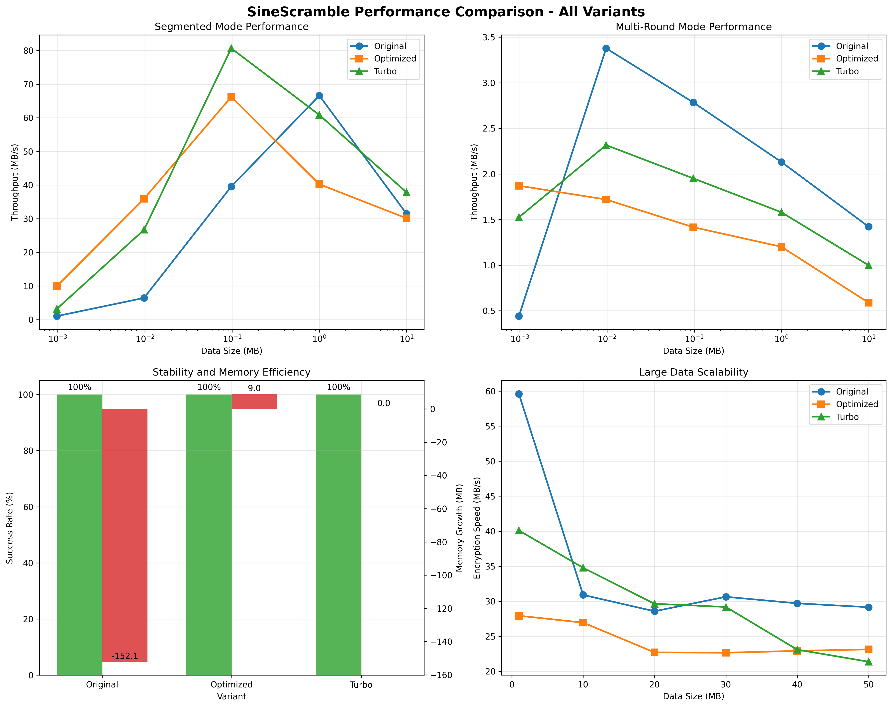

# SineScramble Cipher

A novel symmetric encryption algorithm that combines sine-wave-based permutation and substitution, supporting both high-security Multi-Round Mode and high-performance Segmented Mode.

**Version:** 2.1.0  
**Author:** N Lisowski

## Overview

SineScramble is a flexible symmetric cipher designed to address the classic cryptographic trade-off between security and performance. It features two distinct operational modes:

- **Multi-Round Mode**: High security through iterative transformations across the entire data block
- **Segmented Mode**: High performance through parallel processing of data segments

## Features

- 🔐 **Dual-mode operation** for security vs. performance optimization
- 🔑 **Multi-dimensional key system** with configurable complexity
- 📊 **Sine-wave-based scoring** for deterministic yet non-linear transformations
- ⚡ **Parallel processing** support in Segmented Mode
- 🧪 **Comprehensive test suite** with performance benchmarks
- 🔧 **Easy-to-use API** with file encryption capabilities

## Quick Start

### Using the automated runner (Recommended)

```bash
# Run tests (sets up environment automatically)
./run.sh

# Run interactive demo
./run.sh demo

# Just set up the environment
./run.sh setup
```

### Manual installation

```bash
# Create virtual environment
python3 -m venv venv
source venv/bin/activate

# Install dependencies
pip install -r requirements.txt
```

## Usage Examples

### Basic Encryption/Decryption

```python
from sinescramble import SineScrambleCipher, OperationMode
from sinescramble.utils import generate_random_key

# Generate a random key
key = generate_random_key(8)  # 8-dimensional key

# Create cipher instance
cipher = SineScrambleCipher(key, OperationMode.MULTI_ROUND)

# Encrypt and decrypt
message = "Hello, SineScramble!"
encrypted = cipher.encrypt(message)
decrypted = cipher.decrypt(encrypted).decode('utf-8')

print(f"Original:  {message}")
print(f"Decrypted: {decrypted}")
print(f"Success:   {message == decrypted}")
```

### Password-based Keys

```python
from sinescramble.utils import key_from_password

# Generate deterministic key from password
key = key_from_password("MySecurePassword123!", dimension=6)
cipher = SineScrambleCipher(key, OperationMode.SEGMENTED)
```

### File Encryption

```python
# Encrypt a file
cipher.encrypt_file("document.txt", "document.encrypted")

# Decrypt a file
cipher.decrypt_file("document.encrypted", "document_decrypted.txt")
```

### Key Management

```python
from sinescramble.utils import key_to_string, string_to_key

# Serialize key for storage
key_string = key_to_string(key)
print(f"Serialized key: {key_string}")

# Restore key from string
restored_key = string_to_key(key_string)
```

## Algorithm Details

### Scoring Function

The core of SineScramble is a scoring function that generates deterministic scores for data indices:

```
score_j(i) = A × sin(k_j × γ + i × ω) + i
```

Where:
- `A` = Amplitude (controls sine wave influence)
- `k_j` = Key component for round/segment j
- `γ` = Phase parameter
- `ω` = Frequency parameter
- `i` = Data index

### Multi-Round Mode

```
Ciphertext = Round_n(...Round_2(Round_1(Plaintext, k_1), k_2)..., k_n)
```

Each round applies:
1. **Permutation** based on sorted scores
2. **Substitution** (XOR) based on score fractional parts

### Segmented Mode

```
Ciphertext = Concat(Round(S_1, k_1), Round(S_2, k_2), ..., Round(S_n, k_n))
```

Data is split into n segments, each processed in parallel with its corresponding key component.

## Performance Characteristics

| Mode | Security | Speed | Use Case |
|------|----------|-------|----------|
| Multi-Round | Very High | Moderate | Data-at-rest, secure storage |
| Segmented | High | Very High | Real-time streams, low latency |

## Security Considerations

⚠️ **Important**: SineScramble is a research cipher and has not undergone formal cryptanalysis by the broader cryptographic community. It should not be used for production security applications without proper peer review and validation.

### Key Space
- Theoretical key space: `(2^64)^n` where n is key dimension
- Recommended minimum dimension: 4 (for basic security)
- Recommended dimension for high security: 8-16

### Resistance Properties
- **KPA Resistance**: Strong in Multi-Round mode due to nested transformations
- **Avalanche Effect**: Excellent in Multi-Round mode, localized in Segmented mode
- **Confusion**: Strong through sine-based substitution
- **Diffusion**: Complete in Multi-Round, segment-local in Segmented mode

## API Reference

### SineScrambleCipher

Main cipher class supporting both operational modes.

#### Constructor
```python
SineScrambleCipher(key, mode, amplitude=100.0, frequency=0.1, phase=1.0)
```

#### Methods
- `encrypt(data)` - Encrypt data (string, bytes, or bytearray)
- `decrypt(data)` - Decrypt encrypted bytes
- `encrypt_file(input_path, output_path)` - Encrypt file
- `decrypt_file(input_path, output_path)` - Decrypt file

### Utility Functions

- `generate_random_key(dimension, seed=None)` - Generate random key
- `key_from_password(password, dimension)` - Derive key from password
- `key_to_string(key)` / `string_to_key(key_string)` - Key serialization
- `validate_key(key)` - Validate key format
- `estimate_security_level(dimension)` - Estimate security based on key size

## Running Tests

The test suite includes:
- Basic encryption/decryption verification
- Key management functionality
- Different data type support
- File operations
- Avalanche effect analysis
- Performance benchmarking
- Use case recommendations

```bash
# Run all tests
./run.sh test

# Or manually
python -m sinescramble.test_sinescramble
```

## Interactive Demo

```bash
# Run interactive demo
./run.sh demo
```

The demo allows you to:
- Choose between Multi-Round and Segmented modes
- Use random keys or password-derived keys
- Encrypt/decrypt custom messages
- See the encryption process in action

## Project Structure

```
sinescramble/
├── __init__.py          # Package initialization
├── cipher.py            # Core SineScramble implementation
├── utils.py             # Utility functions
├── test_sinescramble.py # Test suite and demos
├── requirements.txt     # Python dependencies
├── run.sh              # Automated runner script
└── README.md           # This file
```

## Requirements

- Python 3.7+
- NumPy >= 1.21.0

## Contributing

This is a research implementation. Contributions welcome for:
- Performance optimizations
- Additional test cases
- Security analysis
- Documentation improvements

## Future Work

- Formal cryptanalysis and peer review
- Hardware acceleration support
- Additional operational modes
- Stream cipher variant
- Cryptographic analysis tools 

## Performance Benchmarks



**Figure:** Performance comparison of SineScramble cipher variants (Original, Optimized, Turbo) across different modes and data sizes. The plots show throughput (MB/s), memory efficiency, and scalability for both Segmented and Multi-Round modes. For a high-level overview, see the [main Perturbarium README](../../README.md). 